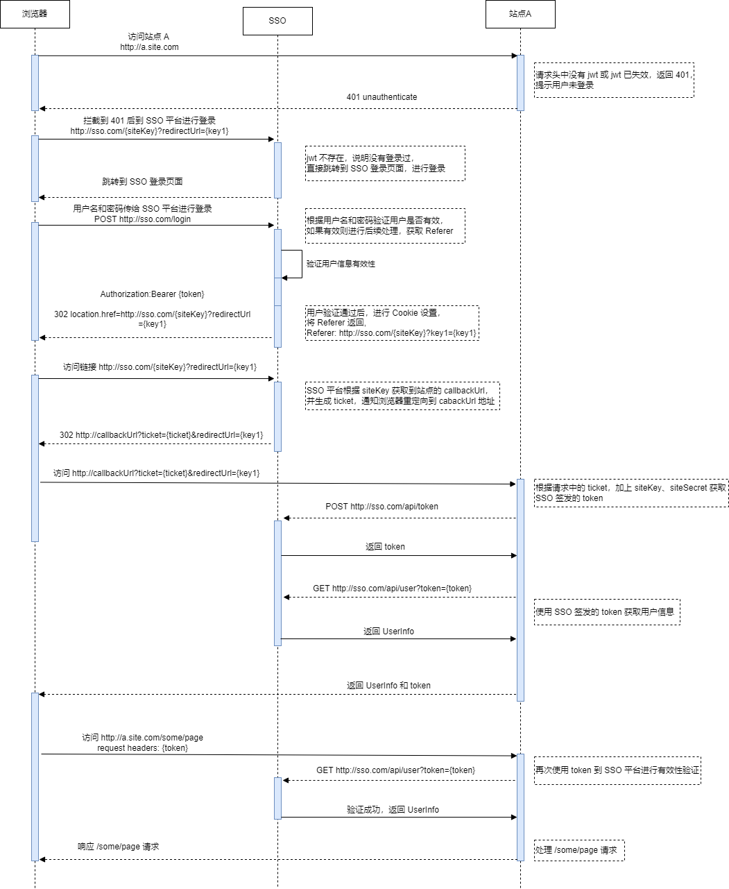

	<strong>SSO Admin</strong>

    
    
    
    

SSO Admin 是一个单点登录管理系统，对接入的站点可实现统一的登录。

### 单点登录流程

用户登录成功后，会跳转到站点指定的 callback url，ticket 参数通过 query param 传递。 
如果登录成功后需要传递其他参数，请在跳转到 SSO 地址时添加自己的参数（如：http://sso.com/{siteKey}?key1=value1&key2=value2）。
用户登录成功后，会将这些参数通过 callback url 传递。例如：https://callbackurl?ticket=****&key1=value1&key2=value2。
